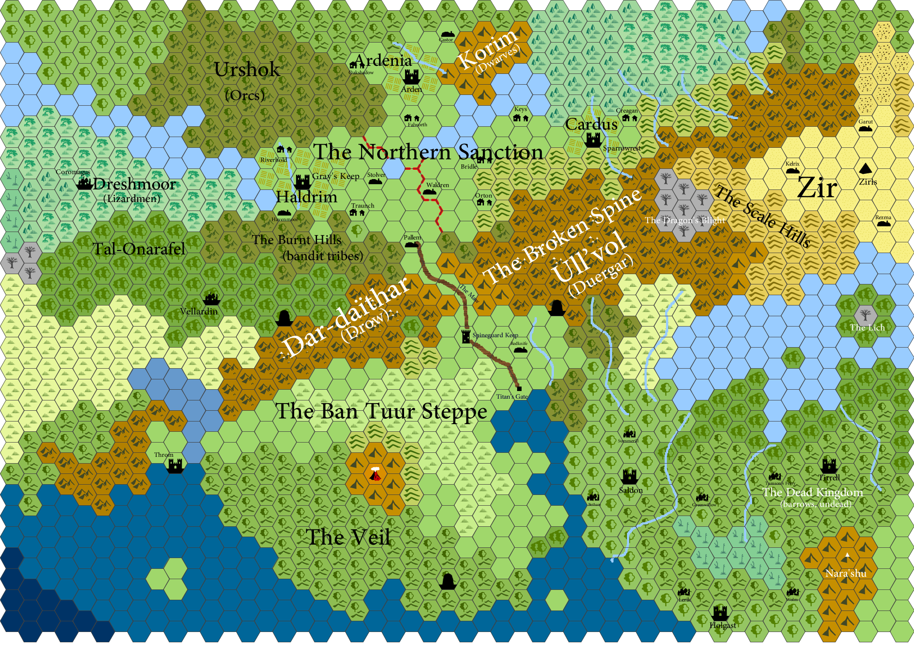

# World of Collabris
An Open Source Implementation of [Matt Colville](https://twitter.com/mattcolville/)'s
Dungeons and Dragons Setting

*Map of the Spinelands of Collabris*

## Disclaimer
At the time of writing, the following project has not been officially endorsed
by Matt Colville, nor the hundreds of people watching him on Twitch that made
this all possible. Until the owner of this repository receives the green light
from the original author, consider this an unofficial source.

*You have been warned.*

## Legal
If you are Matt Colville and would like to give either your consent or damnation
to this project, please contact the owner on
[Twitter](https://twitter.com/ItsSeaJay/).

In addition, this repository has nothing to do with Hasbro or Wizards of the
Coast, creators and distributors of the Dungeons and Dragons tabletop role-playing
game.

In case anything happens to this repository, the original document is available
for free on [Matt's Website](http://squaremans.com/Collabris.pdf).

## Description
Collabris is a mid-fantasy campaign setting for the fifth edition of the
Dungeons and Dragons role playing game. Named because of the word's similarity
to `collaboration` (reference to how the setting was created) and `colville`
(surname of the original author), Collabris is a world fit for all kinds of
adventurers, even those from
[the Elemental Evil Player's Companion](http://media.wizards.com/2015/downloads/dnd/EE_PlayersCompanion.pdf).

This project is an attempt to convert that setting from a rock-solid PDF to
a set of Restructured Text files that tech-savvy Dungeon Masters can more easily
expand on and customise. In addition to people being able to have it as a PDF.

## History
(Most of which has been summarised from
[this Reddit post](https://www.reddit.com/r/DnD/comments/4mjk4f/collabris_the_story_so_far_a_world_we_built/))

In 2016, independent fantasy author Matt Colville wanted to show prospective
Dungeon Masters the benefits of building their own world for the game;
how enjoyable it could be and how everyone had the ability to do it.
Using [Hexographer](http://hexographer.com/), he generated a random map and filled
it to the brim with details. All of which was streamed live and most of the
names, places and people were suggested by the viewing audience.

After he'd finished, he released it out into the wild for anyone to use. It was
a huge success. People drew their own versions of the map, created characters
for it and one person
[even created authentic heraldry for all of the known factions](http://www.danconnolly.co.uk/2016/05/to-arms/).

In 2018, after a successful D&D campaign set in Collabris, some jerk named Callum
expressed interest in making Collabris more malliable.
[After a moderately successful post on the `/r/mattcolville` subreddit](https://www.reddit.com/r/mattcolville/comments/8ahdol/open_sourcing_collabris/)
asking for permission to create a GitHub repo based on the world, he decided to
put his money where his mouth is and go for it...
